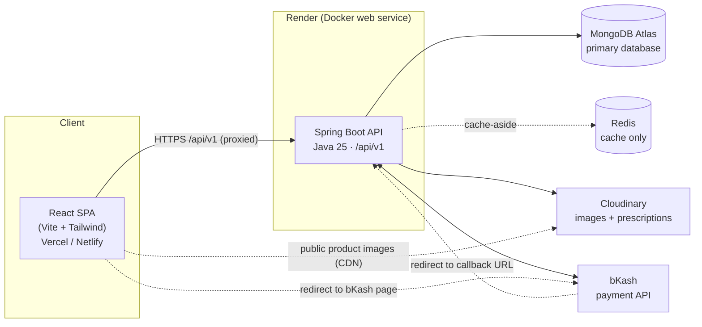
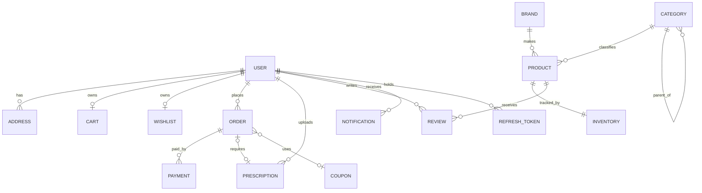
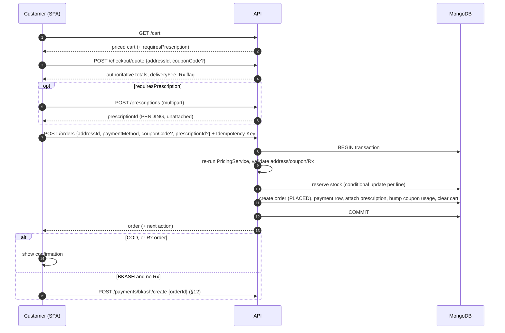
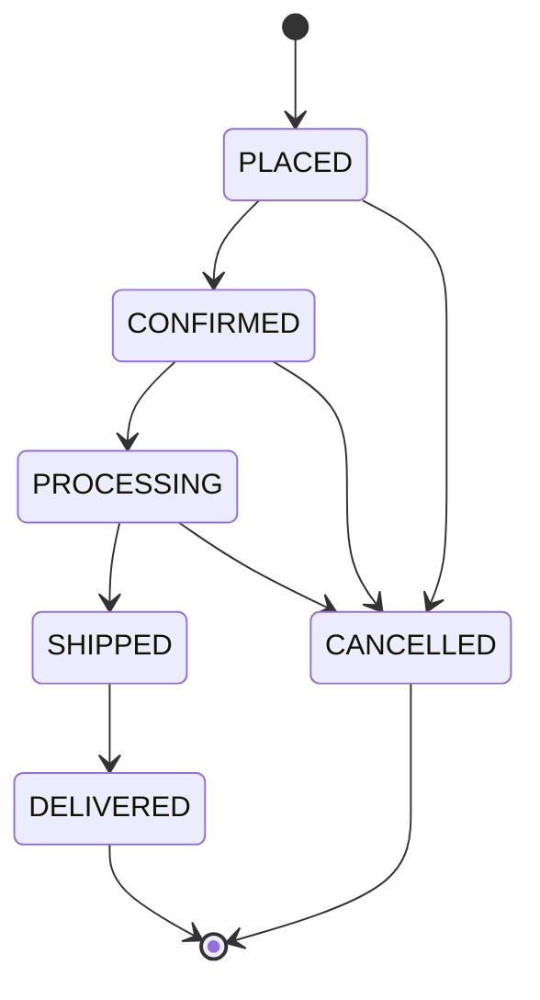
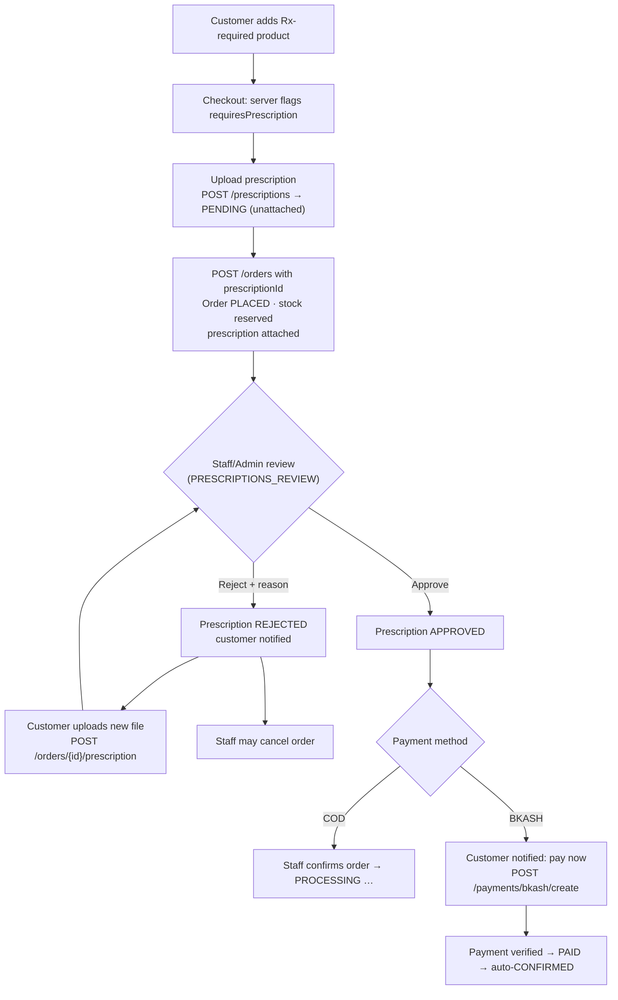
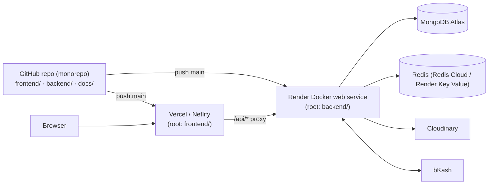

# Neeramoy — System Architecture

| | |
|---|---|
| **Product** | Neeramoy — Online Medicine & Healthcare Marketplace (Bangladesh) |
| **Document** | `docs/architecture.md` |
| **Source of truth** | `prd.md` (section numbers below, e.g. "PRD §17", refer to it) |
| **Status** | Draft v1.0 — ready to drive implementation |
| **Date** | 2026-10-01 |
| **Scope of this document** | Design only. No application code. |

---

## 0. How to read this document

- Sections 1–2 interpret the PRD, list the decisions I had to make where the PRD is silent or explicitly defers (PRD §20, §45), and map scope to build phases.
- Sections 3–16 are the architecture itself.
- Sections 17–23 cover cross-cutting concerns (errors, validation, security, config, testing, deployment).
- Section 24 defines the **future** Spring AI/RAG integration point. It is **not** part of the current scope.
- Where I am unsure of a third-party detail (bKash field names, library versions for Spring Boot 4), it is marked **⚠ Verify** so you check it against official docs before coding.

---

## 1. PRD analysis

### 1.1 What the PRD asks for, in one paragraph

A customer-facing medicine marketplace (browse → search → cart → checkout → COD or bKash → track), with a prescription gate for Rx-required products, plus an admin/staff back office (catalog, inventory, orders, prescriptions, customers, reviews, coupons, analytics). Frontend and backend deploy separately. MongoDB is the source of truth, Redis is a cache only, Cloudinary stores files, and the backend — never the frontend — is authoritative for prices, payment status, roles, and prescription approval (PRD §57).

### 1.2 Technology direction — unchanged

No part of the PRD's stack (§49) is changed. Two clarifications that are *implementation choices within* the stack, not changes:

| Clarification | Why |
|---|---|
| Render hosts the Spring Boot API as a **Docker** web service | Render has no native Java runtime; Docker is the standard way to run Java there. |
| JWT is implemented with **Spring Security's built-in JWT support** (Nimbus JOSE, via `oauth2-resource-server`) rather than a third-party JWT library | Spring Boot 4 moved to newer baselines (Spring Framework 7, Security 7, Jackson 3). Using Spring's own JWT support avoids third-party library compatibility risk. Still "Spring Security + JWT" as the PRD requires. |

### 1.3 Decisions where the PRD is silent or defers

| # | Topic | PRD says | Decision | Rationale |
|---|---|---|---|---|
| D1 | **bKash capture vs. prescription approval** | §45: "should be finalized during technical design" | **Orders with Rx items paid by bKash are paid *after* prescription approval.** Non-Rx bKash orders pay immediately at checkout. COD Rx orders are placed immediately and wait for approval before confirmation. | Matches the §45 flow diagram (Review → Approved → Payment). Avoids charging money and then refunding if a prescription is rejected. |
| D2 | **When is the order created for bKash?** | §43 shows create payment → pay → confirm | **Order is created first** (status `PLACED`, payment `PENDING`), then payment is attempted against it. | Needed for D1; gives retries, an audit trail, and a stable `merchantInvoiceNumber`. Unpaid holds expire (see §10.5). |
| D3 | **Stock accounting** | §27 lists current/reserved/sold | **Reserve at placement, commit at `SHIPPED`, release on cancel/expiry.** | Prevents overselling without decrementing real stock for orders that may be cancelled. |
| D4 | **Auth tokens / logout** | §7 login, logout, JWT | Short-lived **access JWT** (in memory) + **opaque refresh token** in an `HttpOnly` cookie, stored hashed in MongoDB; logout revokes it. Frontend proxies `/api/*` to the backend so cookies are first-party. Fallback if time is tight: access-token-only (§8.6). | Stateless JWT cannot be "logged out" otherwise. Same-origin proxy avoids Safari/ITP third-party-cookie problems between Vercel/Netlify and Render domains. |
| D5 | **Guest cart / guest checkout** | Not specified | **Cart requires login.** Guests can browse and search; "Add to cart" redirects to login and replays the action. | Server-side cart is simplest and consistent with backend price authority (§14). |
| D6 | **Login identifier** | Registration has email + phone; login not specified | Login with **email *or* phone** + password. Both unique. | Phone-first is common in Bangladesh. No OTP/email verification in MVP (see gaps). |
| D7 | **Prescription cardinality & reuse** | One file URL per prescription (§18) | **One prescription (one file) per order. No reuse across orders in MVP.** An uploaded-but-unattached prescription can be attached to the *next* order. | Simplest model that satisfies the PRD. Reuse rules are a policy/legal question for you (see §1.4). |
| D8 | **Delivery fee rule** | §14, §19 show a fee, no rule | Fee is **settings-driven**: one fee for inside Dhaka (district = Dhaka), one for outside, optional free-delivery threshold. | Keeps the rule changeable without code. Exact amounts are yours to set. |
| D9 | **Staff permissions** | §32 "assign operational permissions" | Three fixed permissions: `ORDERS_MANAGE`, `INVENTORY_MANAGE`, `PRESCRIPTIONS_REVIEW`. Admin implicitly has all. | Minimal granular model that satisfies §4.2/§32 without a permissions framework. |
| D10 | **Platform configuration & banners** | §4.3 "Platform configuration", §8 promo banner, §36 `banners/` — but no admin screen in §42 | A small `settings` document (delivery fees, hold timers) and a `banners` collection, managed from **one "Settings" admin screen** (Should-have; seed banners in MVP). | Directly implied by §4.3/§8/§36; flagged here because it is a small addition to the §42 screen list. |
| D11 | **Payment monitoring screen** | §4.3 lists it; §42 has no payments screen | **No new screen.** Payment status is a column/filter on Admin Orders and a panel on Order Details (including payment attempts and refund action). | Avoids adding scope. |
| D12 | **Money type** | Not specified | `BigDecimal`, scale 2, stored as MongoDB **Decimal128**; rounding `HALF_UP`; currency BDT implied. | Avoids floating-point error. |
| D13 | **Search approach (MVP)** | §11 "useful results"; Atlas/AI search later | MongoDB text index + anchored prefix match on normalized name fields. "Better search" (Atlas Search) is a later upgrade. | PRD lists "Better search" under Should-have (§51). |
| D14 | **Notifications** | §35 in-app first | In-app notifications stored in MongoDB, fetched by polling (unread count every ~60 s). No WebSocket/email/SMS. | Email/SMS is explicitly future (§52). |

### 1.4 Gaps and open questions for you

These do not block the design but you should decide them before the relevant phase.

1. **Password reset / forgot password** is not in the PRD, and email/SMS are future features. MVP therefore has *change password while logged in* only; an admin can reset a customer's password manually if needed. Decide whether to add reset later (needs email/SMS).
2. **Email/phone verification** is absent. Registration is not verified in MVP.
3. **Prescription reuse and validity period** (can an approved prescription cover a refill? for how long?) — policy decision. MVP: no reuse.
4. **Multi-page prescriptions** — MVP is one file (image or PDF). Say so in UX copy.
5. **Delivery fee amounts and free-delivery threshold** (D8).
6. **Hold timers:** how long to hold stock for an unpaid bKash order (default proposed: 30 min non-Rx; 24 h after approval for Rx).
7. **bKash merchant access:** the real credentials and exact API workflow come from bKash (PRD §20). For an academic demo, use the **sandbox**.
8. **Regulatory note:** selling Rx medicine online in Bangladesh has licensing requirements. For an academic project, show a visible "demo project" notice in the footer. This is a recommendation, not a PRD requirement.

### 1.5 Explicitly out of scope (reaffirmed)

Spring AI/RAG, AI assistants, AI prescription approval, recommendations, email/SMS, delivery-partner integration, multi-vendor pharmacies, ERP/accounting, inventory forecasting (PRD §52–53). Nothing in this architecture depends on them.

---

## 2. Scope mapping and build phases

PRD §50–52 define MVP / Should-have / Future. The architecture is designed so Should-haves slot in without rework (e.g., the staff permission model and the Redis cache abstraction exist from day one but are switched on later).

| Phase | Goal | Contents |
|---|---|---|
| **0** | Foundations | Monorepo, CI, Atlas cluster, Cloudinary account, Spring Boot skeleton, React skeleton, **first deploy of both**, seed data. |
| **1** | Auth + catalog (read) | Register/login/JWT/roles, categories, brands, products, search, filters, product details, homepage. |
| **2** | Admin catalog + inventory | Admin CRUD for products/categories/brands, Cloudinary image upload, inventory (stock, reserved, thresholds). |
| **3** | Cart → order (COD) | Addresses, cart, pricing service, checkout, COD order, order history/tracking, admin order management. |
| **4** | Prescriptions | Upload, Rx gating at checkout, review queue, approve/reject. |
| **5** | bKash | Create/execute/verify, callbacks, retries, reconciliation, pay-after-approval. |
| **6** | Should-haves | Wishlist, reviews, coupons, notifications, staff role, analytics, low-stock dashboard, Redis caching, cancellation requests, customer dashboard polish. |
| **7** | Hardening | Security review, test gaps, demo data, performance pass, docs. |
| **Later** | Future | Spring AI/RAG (§24) etc. |

> Deploy at the end of Phase 0 and redeploy every phase. Discovering a Render/Atlas/CORS problem in Phase 7 is the most common academic-project failure.

---

## 3. Overall system architecture

### 3.1 Context diagram



### 3.2 Architectural style

**Modular monolith.** One Spring Boot application, one MongoDB database, packages organized by business feature, strict layering inside each feature. This is deliberate:

- The PRD asks for a *clear layered architecture* (§48) and *no rewrite for future growth* — feature packages with service-level boundaries give that.
- Microservices would add deployment, networking, and data-consistency problems that an academic timeline cannot absorb.
- The Spring AI/RAG module (§24) can be added later as one more package or split out then.

### 3.3 Responsibilities

| Component | Owns | Never does |
|---|---|---|
| **React SPA** | UI, routing, form UX validation, server-state caching in the browser, redirecting to bKash | Compute authoritative prices, decide payment success, enforce authorization |
| **Spring Boot API** | All business rules, authN/authZ, pricing, stock, order state, payment verification, prescription workflow, Cloudinary/bKash/Redis access | Trust any price, role, or payment status sent by the client |
| **MongoDB Atlas** | All persistent business data (source of truth) | Store binary files |
| **Redis** | Cached read models (§13) | Hold the only copy of anything; be required for correctness |
| **Cloudinary** | Image/file bytes + CDN | Business data |
| **bKash** | Payment execution | Order/inventory state |

### 3.4 Guiding rules (from PRD §57)

1. Backend recomputes every price; the client sends product IDs and quantities only.
2. `paymentStatus` becomes `PAID` only after backend verification with bKash.
3. Only users with the right role/permission can approve a prescription.
4. If Redis is down, the app still works (slower).
5. No secrets in Git.

---

## 4. Frontend architecture

### 4.1 Stack

| Concern | Choice | Notes |
|---|---|---|
| Framework | React (current stable) + Vite | Per PRD. SPA, no SSR. |
| Styling | Tailwind CSS | Design tokens from `ui-ux-spec.md` mapped into the Tailwind theme. |
| Routing | React Router | Route guards for auth/role. |
| Server state | TanStack Query | Caching, retries, invalidation, pagination. |
| Client state | Zustand (small) | Auth session, checkout wizard, UI flags only. |
| HTTP | Axios (or `fetch` wrapper) | Interceptors for auth + error mapping. |
| Forms/validation | React Hook Form + Zod | Zod schemas mirror backend rules for UX; backend remains authoritative. |
| Charts | Recharts | PRD §28 "frontend charting library". |
| Icons | Lucide | Outline icons, consistent with the visual spec. |
| Accessible primitives | Radix UI (dialog, dropdown, tabs, popover) | Styled with Tailwind; avoids hand-rolling a11y. |
| Toasts | Sonner or react-hot-toast | |

All of these are recommendations that can be swapped; none changes the PRD's stack.

### 4.2 Folder structure

```text
frontend/
├── index.html
├── vite.config.ts            # dev proxy: /api -> http://localhost:8080
├── vercel.json | netlify.toml  # SPA fallback + /api proxy to Render
├── .env.example
└── src/
    ├── app/
    │   ├── router.tsx          # route table + lazy-loaded admin chunk
    │   ├── providers.tsx       # QueryClient, auth bootstrap, toaster
    │   ├── layouts/            # PublicLayout, AccountLayout, AdminLayout, CheckoutLayout
    │   └── guards/             # RequireAuth, RequireRole, RequirePermission
    ├── features/
    │   ├── auth/
    │   ├── catalog/            # home, listing, search, product details, categories
    │   ├── cart/
    │   ├── wishlist/
    │   ├── checkout/           # steps: address, prescription, summary, payment
    │   ├── payments/           # bKash redirect + result page
    │   ├── orders/             # list, details, tracking, cancel
    │   ├── prescriptions/
    │   ├── reviews/
    │   ├── account/            # profile, addresses, notifications
    │   └── admin/
    │       ├── dashboard/  products/  categories/  brands/  inventory/
    │       ├── orders/  customers/  prescriptions/  reviews/
    │       └── coupons/  staff/  analytics/  settings/
    │   (each feature: api/ hooks/ components/ pages/ schemas/ types.ts)
    ├── components/ui/          # Button, Input, Select, Card, Badge, Modal, Drawer,
    │                           # Table, Skeleton, Toast, EmptyState, Pagination, Stepper, ...
    ├── lib/
    │   ├── apiClient.ts        # axios instance, interceptors
    │   ├── queryClient.ts
    │   ├── format.ts           # ৳ currency, dates
    │   ├── cloudinary.ts       # delivery-URL/transformation helper
    │   └── errors.ts           # ProblemDetail -> UI message mapping
    ├── stores/                 # authStore, checkoutStore
    └── styles/                 # tailwind entry, tokens
```

### 4.3 Route table and guards

| Area | Routes | Guard |
|---|---|---|
| Public | `/`, `/products`, `/search`, `/categories/:slug`, `/products/:slug`, `/login`, `/register` | none |
| Payment return | `/payment/result` | none (reads status from backend using a signed-in session) |
| Customer | `/cart`, `/checkout/*`, `/order-confirmation/:orderNumber`, `/account/**` | `RequireAuth` |
| Admin/staff | `/admin/login`; `/admin/**` | `RequireRole(ADMIN, PHARMACY_STAFF)` + per-route `RequirePermission` |
| Fallback | `*` (404), 403 page | — |

> Frontend guards are **UX only**. The backend independently enforces every rule (§8).

### 4.4 Auth handling in the SPA

- Access token is kept **in memory** (not `localStorage`) to reduce XSS exposure.
- On app load, the SPA calls `POST /auth/refresh` (the browser sends the `HttpOnly` cookie) to restore the session silently.
- An Axios request interceptor adds `Authorization: Bearer <access>`.
- A response interceptor handles `401` with a **single-flight refresh** (one refresh at a time, queued requests replay), then logs out and redirects to `/login?returnTo=…` if refresh fails.
- "Add to cart" as a guest stores the intended action in `sessionStorage`, redirects to login, then replays it.

### 4.5 Data fetching conventions

- Query keys: `['products', filters]`, `['product', slug]`, `['cart']`, `['orders', page]`, `['order', id]`, `['admin','orders', filters]`.
- After mutations, invalidate precisely: add-to-cart → `['cart']`; place order → `['cart']`, `['orders']`; approve prescription → `['admin','prescriptions']` and `['admin','order', id]`.
- Pagination is server-side everywhere (PRD §10). Search input is debounced (~300 ms).
- Route-level code splitting: admin code loads lazily so customers never download it.

### 4.6 Checkout and payment on the client

- Checkout is a multi-step flow (address → prescription (only if needed) → summary → payment). Step state lives in a small Zustand store; the **server quote** (`POST /checkout/quote`) provides every number displayed.
- Each "Place order" attempt generates a UUID sent as the `Idempotency-Key` header, so double-clicks or retries cannot create duplicate orders.
- For bKash: the SPA receives a `bkashURL` from the backend and does `window.location.assign(bkashURL)`.
- `/payment/result?order=<orderNumber>&status=<hint>` treats the `status` query parameter as a **hint only**. It calls the backend for the real payment/order state and polls (≈2 s interval, ≈30 s cap) while the state is `PROCESSING`.

### 4.7 Files and images on the client

- Public product/category/brand/banner images use Cloudinary delivery URLs with transformations (`f_auto,q_auto,c_fill,w_<size>`) built by `lib/cloudinary.ts`; images are lazy-loaded with explicit dimensions to avoid layout shift.
- Prescription files are **private** — the SPA fetches them from the backend with the auth header as a blob and renders an object URL (a plain `` cannot carry the Authorization header).
- Uploads go **to the backend as `multipart/form-data`**, never directly to Cloudinary (§14).

### 4.8 Error and loading UX

Global error boundary; 404/403 pages; toasts for mutation errors; field-level errors mapped from backend validation responses; skeleton loaders for lists and details; offline banner. Visual definitions are in `ui-ux-spec.md`.

---

## 5. Spring Boot backend architecture

### 5.1 Starters and libraries

| Purpose | Dependency (Spring Boot 4.x) |
|---|---|
| REST | `spring-boot-starter-webmvc` (⚠ Verify: Boot 4 renamed/modularized starters; generate the project with Spring Initializr and confirm names) |
| MongoDB | `spring-boot-starter-data-mongodb` |
| Redis + cache | `spring-boot-starter-data-redis`, `spring-boot-starter-cache` |
| Security | `spring-boot-starter-security`, `spring-boot-starter-oauth2-resource-server` (for JWT decoding/encoding) |
| Validation | `spring-boot-starter-validation` |
| Ops | `spring-boot-starter-actuator` (health/info only) |
| Media | Cloudinary Java SDK (⚠ Verify the current artifact/version supports Java 25) |
| API docs (dev aid) | springdoc-openapi (⚠ Verify a Boot-4-compatible release) — optional, helps Postman and the frontend |
| Tests | `spring-boot-starter-test`, Testcontainers (MongoDB) |

Avoid Lombok (JDK-version friction) — use Java **records** for DTOs and plain classes for documents. Avoid MapStruct unless the team already knows it; small hand-written mappers are enough.

> **⚠ Verify at project init:** Java 25 + Spring Boot 4 uses newer baselines (Spring Framework 7, Spring Security 7, Jackson 3, Jakarta EE 11). Check every third-party library you add against that baseline before committing to it.

### 5.2 Package structure (by feature, layered inside)

```text
backend/src/main/java/com/neeramoy/
├── NeeramoyApplication.java
├── config/            # SecurityConfig, CorsConfig, MongoConfig, RedisCacheConfig,
│                      # CloudinaryConfig, SchedulingConfig, @ConfigurationProperties classes
├── common/
│   ├── api/           # PageResponse, ApiError helpers
│   ├── exception/     # domain exceptions + GlobalExceptionHandler
│   ├── model/         # BaseDocument (id, createdAt, updatedAt, createdBy, updatedBy)
│   ├── validation/    # custom validators (BD phone, file type)
│   └── util/          # Money, Slugs, SearchText, Clock
├── auth/              # AuthController, AuthService, JwtService, RefreshTokenService, filters
├── user/              # User, UserRepository, UserService, UserController (/users/me),
│                      # AdminCustomerController, AdminStaffController
├── address/
├── catalog/
│   ├── category/  brand/  product/  search/
├── inventory/
├── cart/
├── wishlist/
├── pricing/           # PricingService (single source of price truth)
├── order/             # OrderController, AdminOrderController, CheckoutService,
│                      # OrderService, OrderStateMachine, OrderNumberGenerator
├── payment/           # PaymentController, BkashCallbackController, PaymentService,
│   └── bkash/         # BkashClient, BkashProperties, BkashTokenProvider
├── prescription/
├── review/
├── coupon/
├── notification/
├── media/             # MediaService (Cloudinary facade)
├── settings/          # Settings, Banner
├── admin/             # DashboardController, AnalyticsService (read-only aggregations)
└── ai/                # RESERVED for future phase — not created in MVP
```

Inside each feature package:

```text
feature/
├── FeatureController.java      # HTTP only: map request → DTO → service → response DTO
├── FeatureService.java         # business rules, transactions, authorization-sensitive logic
├── FeatureRepository.java      # Spring Data MongoDB interface (+ custom impl if needed)
├── model/   Feature.java       # @Document
└── dto/     CreateFeatureRequest, FeatureResponse (records)
```

### 5.3 Layer rules (Controller → Service → Repository)

| Layer | Allowed | Forbidden |
|---|---|---|
| **Controller** | Parse/validate input (`@Valid`), call **one** service method, shape the response, set HTTP status | Business logic, repository access, building queries |
| **Service** | Business rules, orchestration across modules (via *other services*), transactions, cache annotations, event publishing | HTTP types (`HttpServletRequest`, `ResponseEntity`), returning documents directly to controllers |
| **Repository** | Persistence queries only | Business rules |
| **Document (entity)** | State + simple invariants | Being serialized directly to the API |

Cross-module rules:

1. A module **never** touches another module's repository — only its service.
2. Avoid circular dependencies. Direction is one-way: `order → pricing, inventory, coupon, prescription, address, cart`; `payment → order`; `review → order`.
3. For the reverse direction use **Spring application events** (synchronous `@EventListener`): e.g., `OrderCancelledEvent` is consumed by `PaymentService` (refund eligibility) and `NotificationService`; `PrescriptionReviewedEvent` is consumed by `OrderService` and `NotificationService`.
4. Controllers return **DTOs**, never documents — this prevents leaking `passwordHash` or internal fields and prevents mass-assignment on input.

### 5.4 Cross-cutting infrastructure

| Concern | Approach |
|---|---|
| Auditing | Spring Data MongoDB auditing on `BaseDocument` (`createdAt`, `updatedAt`, `createdBy`, `updatedBy`). |
| Transactions | `MongoTransactionManager` + `@Transactional` for multi-document writes (order placement, cancellation, payment confirmation, prescription review). Atlas clusters are replica sets, so transactions work. Keep transactions short; Redis eviction happens *after* commit. Local dev needs a single-node replica set (docker-compose provides it). |
| HTTP client | Spring `RestClient` with explicit timeouts (connect ≈5 s, read ≈15 s) for bKash. No blind retries on non-idempotent calls. |
| Scheduling | `@Scheduled` jobs (§10.5, §12.6). Single instance on Render → no distributed lock needed; add one if you ever scale to multiple instances. |
| Logging | Structured logs with a per-request `traceId` in MDC; never log passwords, tokens, bKash credentials, or prescription URLs. |
| Mongo mapping | `_class` type hints disabled; BigDecimal ↔ Decimal128; `auto-index-creation` enabled (indexes declared via annotations in code). |
| Configuration | `@ConfigurationProperties` classes per integration (`BkashProperties`, `JwtProperties`, `CloudinaryProperties`, `PaymentHoldProperties`); profiles `dev`, `test`, `prod`. |

---

## 6. API layer

### 6.1 Conventions

- Base path: `/api/v1`. JSON only (except multipart uploads and the prescription file stream).
- Resource-oriented REST; plural nouns; HTTP verbs map to CRUD.
- Admin/staff endpoints live under `/api/v1/admin/**` — easy to protect and to reason about.
- Pagination: `?page=0&size=24&sort=…` → `PageResponse<T> { content, page, size, totalElements, totalPages }` (a custom record, **not** Spring's raw `Page`). `size` is capped at 50.
- Sorting uses a **whitelist** of allowed fields per endpoint.
- Timestamps in ISO-8601 UTC; the frontend formats for Asia/Dhaka.
- Money in responses is a decimal string/number with 2 decimals plus `"currency": "BDT"` where relevant.
- `Idempotency-Key` header is supported on `POST /orders`.
- Errors use RFC 9457 `application/problem+json` (§17).
- API docs are generated by OpenAPI (dev profile) and exported to a Postman collection.

### 6.2 Endpoint catalogue

Access legend: `public` · `auth` (any logged-in user) · `customer` · `staff:<PERM>` (staff with permission) · `admin`. Admin always satisfies any `staff:` check.

```text
# AUTH
POST   /auth/register                      public     create CUSTOMER account
POST   /auth/login                         public     returns access JWT; sets refresh cookie
POST   /auth/refresh                       cookie     rotates refresh token, returns new access JWT
POST   /auth/logout                        auth       revokes refresh token, clears cookie

# PROFILE & ADDRESSES
GET    /users/me                           auth
PUT    /users/me                           auth       name, phone (email change not in MVP)
PUT    /users/me/password                  auth       change password
POST   /users/me/avatar                    auth       optional profile image (Cloudinary /profiles)
GET    /addresses                          customer
POST   /addresses                          customer
PUT    /addresses/{id}                     customer   owner only
DELETE /addresses/{id}                     customer   owner only
PATCH  /addresses/{id}/default             customer

# CATALOG (public)
GET    /categories                         public     cached
GET    /categories/{slug}                  public
GET    /brands                             public     cached
GET    /products                           public     q, category, brand, minPrice, maxPrice,
                                                      inStock, rx, minRating, sort, page, size
GET    /products/{slugOrId}                public     cached detail
GET    /products/{id}/related              public
GET    /products/featured                  public     cached
GET    /products/popular                   public     cached
GET    /products/new                       public     cached
GET    /products/suggest?q=                public     autosuggest (name/generic/brand/category)
GET    /banners                            public     cached

# WISHLIST
GET    /wishlist                           customer
PUT    /wishlist/items/{productId}         customer   add (idempotent)
DELETE /wishlist/items/{productId}         customer
POST   /wishlist/items/{productId}/move-to-cart   customer

# CART (server-side; stores productId + quantity only)
GET    /cart                               customer   returns PRICED cart (live prices, stock flags,
                                                      requiresPrescription)
POST   /cart/items                         customer   {productId, quantity}
PATCH  /cart/items/{productId}             customer   {quantity}
DELETE /cart/items/{productId}             customer
DELETE /cart                               customer   clear

# CHECKOUT & ORDERS
POST   /checkout/quote                     customer   {addressId, couponCode?} → authoritative totals
POST   /orders                             customer   {addressId, paymentMethod, couponCode?, prescriptionId?}
                                                      + Idempotency-Key header
GET    /orders                             customer   own orders, paged
GET    /orders/{id}                        customer   owner only; includes statusHistory (tracking),
                                                      payment summary, prescription summary
POST   /orders/{id}/cancel                 customer   {reason} → instant or request (§10.6)
POST   /orders/{id}/prescription           customer   {prescriptionId} (re-attach after rejection)

# PRESCRIPTIONS (customer)
POST   /prescriptions                      customer   multipart upload → PENDING, unattached
GET    /prescriptions                      customer   own history
GET    /prescriptions/{id}                 customer   owner only
GET    /prescriptions/{id}/file            customer|staff:PRESCRIPTIONS_REVIEW
                                                      authorization-checked stream from Cloudinary

# PAYMENTS
POST   /payments/bkash/create              customer   {orderId} → {paymentId, bkashURL}
GET    /payments/bkash/callback            public*    bKash redirect target (*validated server-side, §12)
GET    /orders/{id}/payment                customer   backend-verified payment state (for polling)

# REVIEWS
GET    /products/{id}/reviews              public     APPROVED only
POST   /products/{id}/reviews              customer   must have a DELIVERED order with the product
GET    /reviews/me                         customer
DELETE /reviews/{id}                       customer   own review

# NOTIFICATIONS
GET    /notifications                      auth
GET    /notifications/unread-count         auth
PATCH  /notifications/{id}/read            auth
POST   /notifications/read-all             auth

# ADMIN / STAFF  (all under /admin; coarse rule: ADMIN or PHARMACY_STAFF, then per-endpoint)
GET    /admin/dashboard/summary            admin | staff (widgets filtered by permission)
GET    /admin/analytics/sales              admin      from, to, granularity
GET    /admin/analytics/order-status       admin

GET    /admin/products                     admin
POST   /admin/products                     admin
GET    /admin/products/{id}                admin
PUT    /admin/products/{id}                admin
PATCH  /admin/products/{id}/active         admin      deactivate/reactivate (soft delete)
POST   /admin/products/{id}/images         admin      multipart → Cloudinary
DELETE /admin/products/{id}/images/{publicId}  admin

GET/POST/PUT/PATCH(active)  /admin/categories   admin   (+ image upload)
GET/POST/PUT/PATCH(active)  /admin/brands       admin   (+ image upload)

GET    /admin/inventory                    admin | staff:INVENTORY_MANAGE   filters: low, out, category
PATCH  /admin/inventory/{productId}        admin | staff:INVENTORY_MANAGE   {adjustBy | setStock, lowStockThreshold}

GET    /admin/orders                       admin | staff:ORDERS_MANAGE      filters: status, paymentStatus, date, q
GET    /admin/orders/{id}                  admin | staff:ORDERS_MANAGE
PATCH  /admin/orders/{id}/status           admin | staff:ORDERS_MANAGE      {status, note}
PATCH  /admin/orders/{id}/assign           admin | staff:ORDERS_MANAGE      {staffId} (staff may self-assign)
POST   /admin/orders/{id}/cancellation/decision  admin | staff:ORDERS_MANAGE {approve|reject, note}
POST   /admin/payments/{paymentId}/refund  admin      bKash refund or manual-mark (§12.7)

GET    /admin/prescriptions                admin | staff:PRESCRIPTIONS_REVIEW   default filter: PENDING
GET    /admin/prescriptions/{id}           admin | staff:PRESCRIPTIONS_REVIEW
PATCH  /admin/prescriptions/{id}/approve   admin | staff:PRESCRIPTIONS_REVIEW
PATCH  /admin/prescriptions/{id}/reject    admin | staff:PRESCRIPTIONS_REVIEW   {reason required}

GET    /admin/customers                    admin
GET    /admin/customers/{id}               admin
GET    /admin/customers/{id}/orders        admin
PATCH  /admin/customers/{id}/active        admin

GET/POST/PUT   /admin/staff                admin
PATCH  /admin/staff/{id}/active            admin
PUT    /admin/staff/{id}/permissions       admin

GET    /admin/reviews                      admin      filter by status
PATCH  /admin/reviews/{id}/status          admin      APPROVED | REJECTED

GET/POST/PUT/PATCH(active)  /admin/coupons admin
GET/PUT /admin/settings                    admin      delivery fees, hold timers
GET/POST/PUT/DELETE /admin/banners         admin
```

---

## 7. MongoDB data model

### 7.1 Principles

- **Embed** data that is read together and owned by one parent and whose growth is bounded (cart items, order line snapshots, product images, status history).
- **Reference** (store an `ObjectId`) when entities have their own lifecycle or are queried independently (product → category/brand, order → customer, prescription → order).
- **Snapshot** anything that must not change after the fact: order lines (name, price) and the order's shipping address are copied into the order.
- **Denormalize sparingly**, only where it removes a join on a hot read path and is cheap to maintain (e.g., `brandName` on product for search; rating aggregates on product).
- All documents extend `BaseDocument` (`createdAt`, `updatedAt`, `createdBy`, `updatedBy`).

### 7.2 Relationship diagram



Embedded (not separate collections): cart items, wishlist items, product images, order items, order shipping-address snapshot, order status history, order cancellation request, prescription file metadata.

### 7.3 Collections

Field lists show what matters for design; add audit fields everywhere.

#### `users`
| Field | Notes |
|---|---|
| `_id` | ObjectId |
| `name`, `email`, `phone` | `email` and `phone` unique (normalized: lowercase email; phone stored as `01XXXXXXXXX`) |
| `passwordHash` | BCrypt via Spring's `PasswordEncoder`; never returned by any API |
| `role` | `CUSTOMER` \| `ADMIN` \| `PHARMACY_STAFF` |
| `permissions` | Set of `ORDERS_MANAGE`, `INVENTORY_MANAGE`, `PRESCRIPTIONS_REVIEW` (staff only) |
| `active` | boolean; inactive users cannot authenticate |
| `avatar` | `{url, publicId}` optional |
| `failedLoginCount`, `lockedUntil` | simple brute-force protection (§19) |
| `lastLoginAt` | |

Indexes: unique `email`, unique `phone`, `role`.

#### `refresh_tokens`
`userId`, `tokenHash` (SHA-256 of the opaque token), `expiresAt`, `revoked`, `userAgent`. Indexes: unique `tokenHash`; `userId`; **TTL** on `expiresAt`. Rotation: each refresh issues a new token and revokes the old; reuse of a revoked token revokes the whole user's tokens.

#### `addresses`
`userId`, `recipientName`, `phone`, `division`, `district`, `area`, `addressLine`, `postalCode`, `type` (`HOME`\|`OFFICE`\|`OTHER`), `isDefault`. Index: `userId`. At most one default per user (enforced in service).

#### `categories`
`name`, `slug` (unique), `description`, `image {url, publicId}`, `parentId` (optional; one level is enough), `displayOrder`, `active`. Index: unique `slug`.

#### `brands`
`name`, `slug` (unique), `logo {url, publicId}`, `active`.

#### `products`
| Field | Notes |
|---|---|
| `name`, `slug` (unique), `genericName`, `manufacturer` | |
| `categoryId`, `brandId` | references |
| `categoryName`, `brandName` | **denormalized** for search/sort; updated with `updateMany` when a category/brand is renamed (rare) |
| `nameNormalized`, `genericNameNormalized` | lowercase, trimmed — for anchored prefix search |
| `description` | |
| `medicineInfo` | optional embedded object: `dosageForm`, `strength`, `packSize`, `indications`, `sideEffects`, `storage`, `warnings` (all optional text; shown on details page, PRD §13) |
| `price`, `discountPrice` | Decimal128; `discountPrice` optional and must be `< price` |
| `effectivePrice` | derived: `discountPrice ?? price`; recalculated on every price/discount write; makes price filtering and sorting indexable (§9.1) |
| `inStock` | derived boolean maintained by `InventoryService` when availability crosses zero; used for the `inStock` filter and as the cache-eviction trigger (§9.1) |
| `requiresPrescription` | boolean (PRD §17) |
| `images[]` | `{url, publicId, alt, position}` (max ~5) |
| `featured` | boolean (admin-set, drives "Featured products") |
| `ratingAverage`, `ratingCount` | maintained when reviews are approved/removed |
| `soldCount` | incremented when an order is shipped (drives "Popular") |
| `active` | soft delete/deactivate (PRD §29) |

Indexes: unique `slug`; `{active, categoryId, effectivePrice}`; `{active, brandId}`; `{active, inStock}`; `{active, createdAt:-1}`; `{active, soldCount:-1}`; `{active, featured}`; **text index** on `name, genericName, brandName, categoryName`; `nameNormalized`; `genericNameNormalized`.

#### `inventory` (separate from products — PRD §27)
`productId` (unique), `currentStock`, `reservedStock`, `soldQuantity`, `lowStockThreshold`, `lastUpdatedBy`, `lastAdjustmentNote`. **Available = `currentStock − reservedStock`.** Invariants: `reservedStock ≥ 0`, `currentStock ≥ reservedStock`.

*Why separate:* inventory changes on every order; keeping it out of `products` means product-detail cache entries and product documents are not invalidated/rewritten on each sale, and stock updates can be atomic single-document operations.

Low-stock query compares two fields (`currentStock − reservedStock ≤ lowStockThreshold`) using `$expr`; at academic scale this is fine.

#### `carts`
`userId` (unique), `items[] {productId, quantity, addedAt}`, `updatedAt`. **No prices stored** — prices are always computed live (PRD §14).

#### `wishlists`
`userId` (unique), `items[] {productId, addedAt}`.

#### `orders`
| Field | Notes |
|---|---|
| `orderNumber` | unique, human-readable (e.g., `NM-261001-0007`), generated from an atomic daily counter |
| `customerId` | reference |
| `items[]` | **snapshot**: `{productId, name, genericName, imageUrl, unitPrice, effectiveUnitPrice, quantity, lineTotal, requiresPrescription}` |
| `shippingAddress` | **snapshot** of the chosen address |
| `subtotal` | Σ `effectiveUnitPrice × quantity` |
| `productSavings` | Σ `(price − effectiveUnitPrice) × quantity` (informational) |
| `couponCode`, `couponDiscount` | |
| `deliveryFee` | |
| `total` | `subtotal − couponDiscount + deliveryFee` |
| `paymentMethod` | `COD` \| `BKASH` |
| `paymentStatus` | `PENDING` \| `PROCESSING` \| `PAID` \| `FAILED` \| `CANCELLED` \| `REFUNDED` (PRD §20) |
| `status` | `PLACED` \| `CONFIRMED` \| `PROCESSING` \| `SHIPPED` \| `DELIVERED` \| `CANCELLED` (PRD §21) |
| `statusHistory[]` | `{status, at, byUserId, byRole, note}` — powers the tracking timeline |
| `requiresPrescription` | boolean (derived at placement) |
| `prescription` | `{id, status}` summary kept in sync with the prescription document (so staff lists don't need a join) |
| `cancellationRequest` | `{requestedAt, reason, status: PENDING\|APPROVED\|REJECTED, decidedBy, decidedAt, note}` optional |
| `assignedStaffId` | optional |
| `paymentHoldExpiresAt` | for unpaid bKash orders (§10.5) |
| `idempotencyKey` | with `customerId`; partial unique index |

Indexes: unique `orderNumber`; `{customerId, createdAt:-1}`; `{status, createdAt:-1}`; `{paymentStatus, createdAt:-1}`; `{assignedStaffId, status}`; partial unique `{customerId, idempotencyKey}`; `{paymentHoldExpiresAt}` (partial, unpaid only).

> The PRD lists order status and payment status as **separate** concepts — they stay separate here. No extra statuses are added; "awaiting prescription" and "refund pending" are *derived* (§11.4, §12.7).

#### `payments` (one document per payment **attempt**)
`orderId`, `customerId`, `method`, `status` (same enum as order `paymentStatus`), `amount`, `currency` (`BDT`), `bkash {paymentID, trxID, merchantInvoiceNumber, payerReference, statusCode, statusMessage}`, `failureReason`, `attempt`, `paidAt`, `refund {amount, trxID, at, mode: API|MANUAL, by}`, plus a **sanitized** copy of the last provider responses for audit (no credentials/tokens). Indexes: `orderId`; unique sparse `bkash.paymentID`.

COD creates one `payments` row at order placement (`status=PENDING`) so the admin payment view is uniform; it flips to `PAID` when the order is delivered (PRD §44).

#### `prescriptions`
| Field | Notes (PRD §18) |
|---|---|
| `customerId` | |
| `orderId` | null until attached to an order |
| `file` | `{url, publicId, resourceType, format, bytes, originalFilename}`; Cloudinary **authenticated** asset |
| `uploadedAt` | |
| `status` | `PENDING` \| `APPROVED` \| `REJECTED` |
| `reviewedBy`, `reviewedAt` | |
| `rejectionReason` | required when rejected |

Indexes: `{status, uploadedAt}`; `customerId`; `orderId`. Rejected prescriptions are kept (audit); a re-upload creates a **new** document and the order's `prescription` summary points to it.

#### `reviews`
`productId`, `userId`, `orderId`, `rating (1–5)`, `comment`, `image {url, publicId}` optional, `status` (`PENDING`\|`APPROVED`\|`REJECTED`), `createdAt`. Indexes: `{productId, status, createdAt}`; unique `{userId, productId}` (one review per customer per product — a policy choice; relax if you prefer).

#### `coupons`
`code` (unique, uppercase), `discountType` (`PERCENTAGE`\|`FIXED`), `discountValue`, `minOrderAmount`, `maxDiscount`, `startsAt`, `expiresAt`, `usageLimit`, `usedCount`, `active`.

#### `notifications`
`userId`, `type`, `title`, `message`, `link`, `read`, `createdAt`. Index `{userId, read, createdAt:-1}`; optional TTL (e.g., 90 days).

#### `settings` (single document)
`delivery {insideDhakaFee, outsideDhakaFee, freeDeliveryThreshold?}`, `payment {unpaidHoldMinutes, rxHoldHours}`, `maxQuantityPerLine`.

#### `banners`
`title`, `subtitle`, `image {url, publicId}`, `linkUrl`, `position`, `active`, `startsAt?`, `endsAt?`.

#### `counters`
`_id` (e.g., `order-20261001`), `seq` — atomic `$inc` for order numbers.

### 7.4 Referential integrity (no foreign keys in MongoDB)

Enforced in services:

- Cannot deactivate/delete a **category or brand** that has active products unless the admin reassigns or deactivates them first (PRD §30). The API returns `409 CATEGORY_IN_USE` / `BRAND_IN_USE` with the product count.
- Products are **never hard-deleted** once referenced by an order — only deactivated (`active=false`). Order snapshots keep history intact.
- Orders reference customers; customers are **deactivated, not deleted** (PRD §34).

---

## 8. Authentication and authorization

### 8.1 Roles and permissions

`CUSTOMER`, `ADMIN`, `PHARMACY_STAFF` (PRD §5). Staff additionally carry a set of permissions (D9).

| Capability | CUSTOMER | PHARMACY_STAFF | ADMIN |
|---|:-:|:-:|:-:|
| Browse/search catalog | ✅ | ✅ | ✅ |
| Cart, wishlist, addresses, checkout, own orders, own prescriptions, reviews | ✅ | — | — |
| View/process orders, update order status | — | `ORDERS_MANAGE` | ✅ |
| View inventory, adjust stock | — | `INVENTORY_MANAGE` | ✅ |
| View/approve/reject prescriptions | — | `PRESCRIPTIONS_REVIEW` | ✅ |
| Products, categories, brands, banners, settings | — | ❌ | ✅ |
| Customers, staff, coupons, reviews moderation, analytics | — | ❌ | ✅ |
| Refund a payment | — | ❌ | ✅ |

Staff must **not** have unrestricted admin power (PRD §4.2).

### 8.2 Account creation rules

- Public registration **always** creates `CUSTOMER`. The request DTO has no `role` field.
- The first `ADMIN` is created by a startup seeder from env vars (`ADMIN_SEED_*`) if no admin exists. There is no public admin sign-up.
- Staff accounts are created only by an admin (`POST /admin/staff`), with an initial password the staff member changes on first login.

### 8.3 Token design

| Token | Format | Lifetime | Storage |
|---|---|---|---|
| Access | Signed JWT (HS256, secret ≥ 256 bit from env) | ~15 min | SPA memory |
| Refresh | Opaque random string (≥ 256 bit) | ~7 days | `HttpOnly; Secure; SameSite=Strict` cookie; **hashed** in `refresh_tokens` |

Access-token claims: `sub` (userId), `role`, `iss`, `iat`, `exp`, `jti`. Do not put PII in the token.

### 8.4 Request authentication

1. Spring Security's resource-server filter validates signature, issuer, and expiry.
2. A small converter loads the user by `sub` from MongoDB and builds the `Authentication` with authorities: `ROLE_<role>` and `PERM_<permission>`. **Role and permissions are read from the database on every request**, not trusted from the token — this makes deactivation and permission changes effective immediately (PRD §57.8) and costs one indexed `_id` lookup.
3. If the user is `active=false` → `401 ACCOUNT_DISABLED`.

### 8.5 Authorization layers

1. **URL rules** (coarse):
   - `permitAll`: `/auth/register`, `/auth/login`, `/auth/refresh`, public catalog `GET`s, `/payments/bkash/callback`, `/actuator/health`.
   - `/admin/**` → `hasAnyRole('ADMIN','PHARMACY_STAFF')`.
   - everything else → `authenticated`.
2. **Method security** (fine): `@PreAuthorize` on service/controller methods, e.g. `hasRole('ADMIN') or hasAuthority('PERM_PRESCRIPTIONS_REVIEW')`.
3. **Ownership checks in services:** every customer-scoped read/write filters by `customerId = authenticatedUser.id` (orders, addresses, prescriptions, cart, reviews). A customer requesting another customer's order gets `404`, not `403`, to avoid confirming existence.

### 8.6 Logout and the fallback

- **Recommended:** `POST /auth/logout` revokes the refresh token, clears the cookie; the SPA drops the in-memory access token. The access token stays technically valid until it expires (≤ 15 min) — acceptable and standard for stateless JWT.
- **Fallback if schedule is tight:** a single access JWT (e.g., 2 h), returned in the response body, held in memory/`sessionStorage`; logout is client-side only. The refresh-token tables and `/auth/refresh` can be added later without changing other modules.

### 8.7 Passwords

BCrypt through Spring's `PasswordEncoder` (use the delegating encoder so the algorithm can be upgraded). Minimum 8 characters with at least one letter and one digit. Never log or return hashes.

### 8.8 CORS and the same-origin proxy

- Frontend hosting is configured to proxy `/api/*` to the Render URL (Vercel `rewrites` or Netlify `_redirects` with status 200). The browser then sees one origin: cookies are first-party and CORS is not exercised in production.
- Backend still configures CORS from `CORS_ALLOWED_ORIGINS` (explicit origins, `allowCredentials=true`, no wildcards) for local development and as a safety net.
- CSRF protection is disabled for the Bearer-token API. The only cookie-authenticated endpoints (`/auth/refresh`, `/auth/logout`) are protected by `SameSite=Strict` plus the same-origin proxy and return no secret that a cross-site caller could read.

---

## 9. Catalog and search

### 9.1 Listing, filters, sorting (PRD §10–§12)

`GET /products` builds one Mongo query from validated parameters:

| Parameter | Behavior |
|---|---|
| `q` | text search + anchored prefix on normalized name/generic name (§9.2) |
| `category` | category slug (includes child categories) |
| `brand` | brand slug(s) |
| `minPrice`, `maxPrice` | applied to the **effective** price (`discountPrice` if present, else `price`) — stored as a computed `effectivePrice` field on the product, kept in sync on write, so it can be indexed and sorted |
| `inStock` | joins availability from `inventory` (see below) |
| `rx` | `any` \| `only` \| `none` → `requiresPrescription` |
| `minRating` | `ratingAverage ≥ x` |
| `sort` | `price_asc`, `price_desc`, `newest`, `popular`, `rating`; default `popular` (browsing) or best-match (search) |

**Availability filtering:** `inStock=true` should not require a join on every list request. The pragmatic MVP approach is to maintain a boolean `inStock` on the product, updated by `InventoryService` whenever availability crosses zero (reserve/commit/release/adjust). It is the *only* inventory-derived field on the product, and it is also the trigger for evicting that product's cache entry. Checkout still validates real stock from `inventory`.

Inactive products and inactive categories/brands never appear in public results.

### 9.2 Search (MVP)

- **Text index** on name/generic/brand/category for word matching and relevance score.
- **Anchored prefix match** on `nameNormalized` and `genericNameNormalized` for type-ahead (`"parac"` → Paracetamol), using `^<escaped-input>` so the index is used. User input is always regex-escaped (`Pattern.quote`) — never concatenated raw.
- `GET /products/suggest?q=` returns a small mixed list (products, categories), capped, cached briefly.
- **Upgrade path (Should-have, PRD §51):** MongoDB Atlas Search (fuzzy match, autocomplete, synonyms) behind the same `ProductSearchService` interface. The controller and frontend do not change.

### 9.3 Homepage data

The homepage uses separate cached endpoints in parallel: `/categories`, `/banners`, `/products/featured`, `/products/popular`, `/products/new`. No aggregate "home" endpoint is needed.

---

## 10. Cart, checkout, and order architecture

### 10.1 One pricing authority

`PricingService` is the **only** place prices are computed. It is used by `GET /cart`, `POST /checkout/quote`, and `POST /orders` (authoritative, inside the transaction).

```text
Input : cart items (productId, qty), optional addressId, optional couponCode
For each line:
   product must exist and be active
   effectiveUnitPrice = discountPrice ?? price      (read from DB, never from client)
   lineTotal = effectiveUnitPrice × qty
   availability check (inventory: currentStock − reservedStock ≥ qty)
subtotal        = Σ lineTotal
productSavings  = Σ (price − effectiveUnitPrice) × qty
couponDiscount  = validated by CouponService (see below)
deliveryFee     = from Settings by address district (and optional free-delivery threshold on subtotal)
total           = subtotal − couponDiscount + deliveryFee
Output: PricedCart { lines[], subtotal, productSavings, couponDiscount, deliveryFee, total,
                     requiresPrescription, warnings[] }
```

Coupon rules (PRD §26), all server-side: active; within `startsAt`–`expiresAt`; `subtotal ≥ minOrderAmount`; `usedCount < usageLimit`; discount = `PERCENTAGE` → `subtotal × v%`, `FIXED` → `v`; capped by `maxDiscount` and never above `subtotal`. The delivery fee is not discounted.

### 10.2 Checkout sequence



### 10.3 `POST /orders` — server-side rules

All inside one MongoDB transaction:

1. **Idempotency:** if an order with the same `(customerId, Idempotency-Key)` exists, return it.
2. Load the cart; reject if empty (`CART_EMPTY`).
3. Validate the address belongs to the customer; snapshot it.
4. Run `PricingService` (fresh). Reject unavailable/inactive lines (`PRODUCT_UNAVAILABLE`).
5. **Prescription gate:** if any line `requiresPrescription`, require a `prescriptionId` that belongs to the customer, is unattached, and is not `REJECTED` → else `PRESCRIPTION_REQUIRED` / `PRESCRIPTION_INVALID`. The server decides whether a prescription is needed — never the client.
6. Reserve stock for each line with an **atomic conditional update** (only succeeds if `currentStock − reservedStock ≥ qty`); any failure aborts the transaction with `INSUFFICIENT_STOCK` listing the lines.
7. Validate coupon and increment `usedCount` conditionally (`usedCount < usageLimit`).
8. Create the order with `status=PLACED`, `paymentStatus=PENDING`, `statusHistory=[PLACED]`; create the `payments` row; attach the prescription (`orderId`, order summary).
9. Set `paymentHoldExpiresAt` for BKASH orders that do not need a prescription (§10.5).
10. Clear the cart. Publish `OrderPlacedEvent` (→ notifications) after commit.

### 10.4 Stock lifecycle

| Event | `reservedStock` | `currentStock` | `soldQuantity` / `product.soldCount` |
|---|---|---|---|
| Order placed | `+qty` | — | — |
| Order cancelled / hold expired (before ship) | `−qty` | — | — |
| Order **SHIPPED** | `−qty` | `−qty` | `+qty` |
| Admin/staff adjustment | — | set/adjust (cannot go below `reservedStock`) | — |

Whenever availability crosses 0 ↔ >0, `InventoryService` updates `product.inStock` and evicts that product's cache entry (§13).

### 10.5 Hold expiry (unpaid bKash orders)

A scheduled job (every minute) finds orders where `paymentMethod=BKASH`, `paymentStatus ∈ {PENDING, FAILED, CANCELLED}`, `status=PLACED`, and `paymentHoldExpiresAt < now`, then cancels them (release stock, `status=CANCELLED`, `paymentStatus=CANCELLED`, notify).

| Order type | Hold starts | Default length |
|---|---|---|
| bKash, no Rx | at placement | 30 min |
| bKash, with Rx | **when the prescription is approved** (until then no expiry) | 24 h |

Defaults live in `settings` (D8). Because Render free instances sleep, also evaluate expiry lazily whenever an order is read or a payment is created.

### 10.6 Order state machine



Transitions are enforced centrally in `OrderStateMachine` (no controller or service sets `status` directly).

| Transition | Who | Guards |
|---|---|---|
| `PLACED → CONFIRMED` | system or staff | If `requiresPrescription` → prescription must be `APPROVED`. If BKASH → `paymentStatus` must be `PAID`. **Auto-confirm** happens when a BKASH order becomes `PAID` and the Rx condition is met. COD orders are confirmed manually by staff (PRD §44). |
| `CONFIRMED → PROCESSING` | staff/admin | — |
| `PROCESSING → SHIPPED` | staff/admin | Commits stock (§10.4). |
| `SHIPPED → DELIVERED` | staff/admin | If COD → set `paymentStatus=PAID` (cash collected). Enables review eligibility. |
| `→ CANCELLED` | see below | Releases stock. Not allowed from `SHIPPED`/`DELIVERED`. |

Each transition appends to `statusHistory` with actor and optional note.

**Cancellation policy (PRD §23):**

| Order state | Customer action |
|---|---|
| `PLACED` and **not** `PAID` | Cancels **immediately** |
| `PLACED` and `PAID`, or `CONFIRMED`, or `PROCESSING` | Creates a **cancellation request** (`cancellationRequest.status=PENDING`); staff/admin approve or reject |
| `SHIPPED`, `DELIVERED`, `CANCELLED` | Not allowed (`409 CANCELLATION_NOT_ALLOWED`) |

Approving a request cancels the order through the state machine. If the payment was `PAID` by bKash, the order shows a *derived* "refund pending" state until an admin performs the refund (§12.7).

### 10.7 Order numbers and tracking

`orderNumber` format `NM-<yyMMdd>-<seq>` from an atomic `counters` increment. Customer tracking (PRD §22) is rendered from `statusHistory`; no separate tracking endpoint is needed.

---

## 11. Prescription workflow

### 11.1 Flow



### 11.2 Rules

- The system **never** auto-approves (PRD §17). The only code path that sets `APPROVED` is the staff/admin endpoint, restricted to `ADMIN` or `PERM_PRESCRIPTIONS_REVIEW`.
- Review is a conditional update (`status == PENDING`) — a double-click or two reviewers cannot both decide. `REJECTED` requires a non-empty `reason`.
- Review runs in one transaction: update prescription → update order's `prescription` summary → append `statusHistory` note → publish `PrescriptionReviewedEvent` (notifications).
- Only prescriptions **attached to an order** appear in the review queue.
- **Rx + bKash:** `POST /payments/bkash/create` returns `409 PRESCRIPTION_NOT_APPROVED` until approval (D1). The SPA shows "Pay now" on the order only after approval.
- **Rx + COD:** the order stays `PLACED`; `PLACED → CONFIRMED` is blocked until `APPROVED`.
- **Rejected:** the order stays `PLACED`; the customer can re-upload (new document, kept history) or cancel; staff can also cancel. No auto-cancel in MVP.

### 11.3 Upload and storage (also §14)

- Accepted: JPEG, PNG, PDF; max 5 MB (configurable). Validation checks the declared content type **and** magic bytes, and sanitizes the filename.
- Stored in Cloudinary under `neeramoy/prescriptions/` as an **authenticated** (non-public) asset. MongoDB stores metadata only (PRD §18) — never bytes.
- Reading: `GET /prescriptions/{id}/file` verifies *owner* or *staff/admin with review permission*, then streams the bytes from Cloudinary with `Cache-Control: private, no-store`. The raw Cloudinary URL is not usable by the browser and is never returned in API responses. Prescriptions are never cached in Redis.

### 11.4 Derived states shown to users

| Order data | Shown as |
|---|---|
| `requiresPrescription` and no attached prescription | (cannot happen after placement — blocked at checkout) |
| prescription `PENDING` | "Awaiting prescription review" |
| prescription `REJECTED` | "Prescription rejected — upload a new one" + reason |
| prescription `APPROVED`, bKash unpaid | "Prescription approved — complete payment" |
| prescription `APPROVED` | normal order flow |

These are display states derived from existing statuses — no new enum values.

---

## 12. Payments

### 12.1 Model

- Order `status` and `paymentStatus` are independent (PRD §20).
- `payments` stores one row per attempt.
- Payment status values: `PENDING → PROCESSING → PAID | FAILED | CANCELLED`; `FAILED → PROCESSING` (retry); `PAID → REFUNDED`.

### 12.2 Cash on Delivery

`POST /orders` with `COD` → order `PLACED`, payment `PENDING`. Staff confirm → process → ship → deliver; on `DELIVERED` the payment becomes `PAID` (cash collected). If cancelled before delivery → payment `CANCELLED`.

### 12.3 bKash flow

The standard bKash *tokenized checkout* sequence (**⚠ Verify** all endpoint paths, header names, and response fields against the current official bKash developer documentation and your sandbox credentials before coding — PRD §20 says these come from bKash):

```mermaid
sequenceDiagram
  autonumber
  participant U as Customer (SPA)
  participant A as Neeramoy API
  participant K as bKash API
  participant B as bKash payment page

  U->>A: POST /payments/bkash/create {orderId}
  A->>A: authorize owner; order payable; Rx approved (if required)
  A->>K: grant token (cached until near expiry)
  A->>K: create payment (amount = order.total from DB,<br/>merchantInvoiceNumber, callbackURL)
  K-->>A: paymentID + bkashURL
  A->>A: save Payment(PROCESSING); order.paymentStatus = PROCESSING
  A-->>U: {bkashURL}
  U->>B: redirect (window.location)
  B->>B: customer authorizes payment
  B-->>U: redirect to callbackURL?paymentID=…&status=success|failure|cancel
  U->>A: GET /payments/bkash/callback?paymentID&status
  alt status = success
    A->>K: execute payment (paymentID)
    A->>K: query payment status (verify)
    A->>A: verify amount, invoice number, completed status
    A->>A: Payment PAID; order.paymentStatus PAID; auto-CONFIRM if Rx satisfied
  else failure / cancel
    A->>A: Payment FAILED / CANCELLED
  end
  A-->>U: 302 → {FRONTEND}/payment/result?order=NM-…&status=…
  U->>A: GET /orders/{id}/payment  (poll if still PROCESSING)
  A-->>U: backend-verified state
```

### 12.4 Verification rules (what "PAID" requires)

`PAID` is set only when **all** are true, checked on the backend:

1. A `payments` row exists for the `paymentID` and is currently `PROCESSING`.
2. bKash's execute/query response reports the transaction as completed/successful.
3. The amount equals the order `total` stored in MongoDB (never a client value).
4. The invoice number in the response matches the one we sent.
5. The order is still payable (not cancelled/expired).

The browser's `status=success` query parameter only **triggers** verification; it is never evidence of payment (PRD §43).

### 12.5 Idempotency and concurrency

- The transition `PROCESSING → PAID/FAILED` is a **conditional update** (`where status = PROCESSING`), so a duplicate callback, a refresh, or the reconciliation job racing the callback cannot double-apply.
- `bkash.paymentID` has a unique index.
- `merchantInvoiceNumber` is unique **per attempt** (e.g., `NM-261001-0007-1`, `-2`) so retries are not rejected as duplicates (**⚠ Verify** bKash's uniqueness rules in sandbox).
- Create/execute calls are not auto-retried blindly; the token-grant and status-query calls (safe) may retry.

### 12.6 Reconciliation

A scheduled job (every few minutes) queries bKash for payments stuck in `PROCESSING` longer than ~10 minutes (e.g., user closed the tab after paying) and applies the same verification and conditional update. This is also what makes the flow robust to the callback never arriving.

### 12.7 Failure, retry, refund

- **Failed/cancelled payment:** order stays `PLACED`; the customer sees "Retry payment" (new attempt) or "Cancel order." Switching to COD is *not* in the MVP.
- **Refund:** when a `PAID` bKash order is cancelled, an admin triggers `POST /admin/payments/{id}/refund`. If the sandbox/merchant account supports bKash's refund API, the backend calls it; otherwise the admin records a **manual** refund (`refund.mode=MANUAL`). Either path ends in `paymentStatus=REFUNDED`. Until then the order shows derived "refund pending."
- **bKash API unavailable:** `create` returns `502 PAYMENT_PROVIDER_ERROR`; the order remains payable; the SPA shows a retry message.

### 12.8 Security

- Credentials (`BKASH_APP_KEY`, `BKASH_APP_SECRET`, `BKASH_USERNAME`, `BKASH_PASSWORD`) exist only in environment variables; sandbox and production use different values.
- The bKash `id_token` is cached (Redis or in-memory) until shortly before expiry; if the cache is empty the backend simply grants a new one.
- The callback endpoint is public by necessity but does nothing except look up the payment by `paymentID` and run server-side verification. It returns only redirects, never data.
- Never log tokens, secrets, or full provider payloads; persist only a sanitized copy.
- The callback URL must be publicly reachable over HTTPS (the Render URL). For local development use a tunnel, or point sandbox testing at a deployed dev instance.

---

## 13. Redis caching strategy

Redis is a **performance layer only** (PRD §37). MongoDB is always the source of truth.

### 13.1 Mechanism

- Spring Cache abstraction (`@Cacheable` / `@CacheEvict`) with `RedisCacheManager`, **per-cache TTLs**, a versioned key prefix (`neeramoy:v1:`), and JSON serialization.
- Cache **DTOs (records)**, never Mongo documents. Bump the prefix version on deploys that change cached DTO shapes.
- A custom `CacheErrorHandler` **logs and falls through** on any Redis error, so a Redis outage degrades performance, not correctness.
- Because caching is configuration-level, it can be enabled in Phase 6 (PRD Should-have) without touching business code, as long as the `@Cacheable` seams are placed in the catalog services from the start.

### 13.2 What is cached

| Cache name | Content | TTL | Evicted on |
|---|---|---|---|
| `categories` | category list/tree | 1 h | any category write |
| `brands` | brand list | 1 h | any brand write |
| `product-detail` | product DTO by id/slug | 10 min | that product's update/deactivate; rating change; `inStock` flip |
| `products-featured` | featured list | 15 min | any product write (clear all) |
| `products-popular` | popular list | 15 min | TTL (plus any product write) |
| `products-new` | newest list | 10 min | any product write |
| `search-results` | **selected** queries only (first pages of common queries; key = hash of normalized params) | 3 min | TTL only |
| `banners` | active banners | 30 min | banner write |
| `settings` | settings doc | 10 min | settings write |
| `bkash-token` | provider `id_token` | token lifetime − 60 s | TTL |

Staleness is acceptable for up to the TTL on catalog content. **Price and stock are never trusted from cache for money decisions** — checkout and cart always read live from MongoDB via `PricingService`/`InventoryService`.

### 13.3 What is never cached

Users/sessions, carts, wishlists, orders, payments, prescriptions, inventory counts, notifications, anything authorization-related, and any response containing personal data.

### 13.4 Operations notes

Free Redis tiers are small (≈30 MB) — keep cached values small (IDs and card-level DTOs for lists). Prefer `allkeys-lru` eviction. Connect with TLS (`rediss://`) on hosted services.

---

## 14. Cloudinary integration

### 14.1 Folder layout (PRD §36)

```text
neeramoy/
├── products/       public
├── categories/     public
├── brands/         public
├── banners/        public
├── profiles/       public (or authenticated if you prefer)
├── reviews/        public
└── prescriptions/  AUTHENTICATED (private)
```

### 14.2 `MediaService` facade

All Cloudinary calls go through one `MediaService` in the `media` package — no other module imports the SDK.

| Method | Purpose |
|---|---|
| `uploadPublic(file, folder)` | product/category/brand/banner/profile/review images → `{url, publicId}` |
| `uploadPrescription(file)` | authenticated upload to `neeramoy/prescriptions` → metadata |
| `streamAuthenticated(publicId)` | server-side fetch used by the prescription file endpoint |
| `delete(publicId, type)` | best-effort cleanup when an image is replaced/removed |

### 14.3 Upload path

Browser → **backend** (`multipart/form-data`) → Cloudinary. Direct browser-to-Cloudinary signed uploads are intentionally **not** used in the MVP: routing through the API lets us enforce type/size/magic-byte checks, authorization, and per-product image limits uniformly. Limits: 5 MB per file (Spring multipart settings aligned), product images ≤ ~5 per product.

### 14.4 Delivery

- Public images are served from Cloudinary's CDN. MongoDB stores the base `url` and `publicId`; the frontend builds sized variants with transformations (`f_auto,q_auto,c_fill,w_…`).
- Prescriptions are served **only** via the backend endpoint (§11.3).

### 14.5 Metadata

MongoDB stores only `{url, publicId}` (plus `resourceType`, `format`, `bytes` for prescriptions) — no binary data (PRD §36, §18).

---

## 15. Admin and staff architecture

### 15.1 One backend, one frontend app, two experiences

- Same Spring Boot application; admin APIs are namespaced under `/api/v1/admin/**`.
- Same React SPA; the `/admin/**` area uses `AdminLayout` and lazy-loaded code. A separate admin deployment is unnecessary for an academic project, and the frontend/backend remain separately deployable as required.
- `/admin/login` is a separate *screen* using the same `POST /auth/login`; the SPA rejects non-admin/staff roles after login.

### 15.2 Staff experience

- Navigation is generated from the user's **permissions** (UI hint only). A staff member with only `PRESCRIPTIONS_REVIEW` sees Dashboard (limited) and Prescriptions.
- `GET /admin/dashboard/summary` returns only the widgets the caller may see (e.g., pending prescriptions for reviewers, order counts for order managers).
- **Assigned orders (PRD §4.2):** orders have an optional `assignedStaffId`. Staff list endpoints default to *assigned to me + unassigned*; admins see all and can assign; staff can self-assign. *If time is short, simplify to "staff see all orders."*
- Staff see only the customer data necessary for fulfillment (shipping name/phone/address on the order); the customer directory and customer profiles are admin-only.

### 15.3 Admin modules (PRD §42)

Products, Categories, Brands, Inventory, Orders, Customers, Prescriptions, Reviews, Coupons, Staff, Analytics, Settings. Each maps to one controller + service + repository set in the corresponding feature package.

### 15.4 Dashboard and analytics (PRD §28)

Read-only aggregation queries in `AnalyticsService` (MongoDB aggregation pipelines):

| Metric | Definition |
|---|---|
| Total orders / customers / products | counts (customers = role `CUSTOMER`) |
| Total sales | Σ `total` of orders with `paymentStatus=PAID` (refunded orders excluded) |
| Pending orders | `status = PLACED` |
| Pending prescriptions | `status = PENDING` and attached to an order |
| Low-stock products | `currentStock − reservedStock ≤ lowStockThreshold` |
| Recent orders / customers | latest N |
| Sales trend | Σ paid totals grouped by day/week in Asia/Dhaka time |
| Order status distribution | count by `status` |

Charts render in the SPA from these small JSON series. Add indexes if aggregations slow down; caching the dashboard is optional and not needed for demo scale.

### 15.5 Accountability

Audit fields on every document, `statusHistory` on orders, `reviewedBy/At` on prescriptions, `lastUpdatedBy` on inventory, and `refund.by` on payments. A separate audit-log collection is **not** included in the MVP.

---

## 16. Smaller modules

| Module | Design |
|---|---|
| **Wishlist** | One document per user with an items array; "move to cart" is one service call (add to cart + remove from wishlist). |
| **Reviews** | `POST` allowed only if the customer has a `DELIVERED` order containing the product and has not reviewed it. New reviews are `PENDING`; admin moderation sets `APPROVED`/`REJECTED`. On approve/remove, recompute `ratingAverage`/`ratingCount` on the product (aggregation over approved reviews) and evict the product cache. Optional image uploads to `neeramoy/reviews`. |
| **Coupons** | See §10.1; admin CRUD; usage counted at order placement, released if the order is cancelled before shipping. |
| **Notifications** | `NotificationService` listens to domain events (order placed, payment succeeded/failed, order confirmed/shipped/delivered, prescription approved/rejected) and writes `notifications` rows. Frontend polls the unread count. Promotional notifications are out of the MVP. |
| **Addresses** | Owner-scoped CRUD; one default per user; order placement snapshots the address. |

---

## 17. Error handling

### 17.1 Format

All errors use **RFC 9457 Problem Details** (`application/problem+json`), built with Spring's `ProblemDetail`, plus two extension fields:

```json
{
  "type": "https://neeramoy.app/errors/insufficient-stock",
  "title": "Insufficient stock",
  "status": 409,
  "detail": "Some items are no longer available in the requested quantity.",
  "instance": "/api/v1/orders",
  "code": "INSUFFICIENT_STOCK",
  "traceId": "9f2c…",
  "errors": [ { "field": "items[0].quantity", "message": "Only 3 left" } ]
}
```

### 17.2 Implementation

- One `@RestControllerAdvice` (`GlobalExceptionHandler`) maps exceptions → status + `code`.
- Custom `AuthenticationEntryPoint` and `AccessDeniedHandler` return the same JSON for `401`/`403` (otherwise Spring Security returns HTML/empty bodies).
- Domain exceptions: `ResourceNotFoundException` (404), `ConflictException` (409), `BusinessRuleException` (422/409 with a code), `InsufficientStockException` (409, with line details), `PaymentProviderException` (502), `ForbiddenOperationException` (403).
- Unknown exceptions → `500` with a generic message and `traceId`; the stack trace goes to logs only.
- Validation failures → `400` with a per-field `errors[]`.

### 17.3 Error code catalogue (initial)

| HTTP | Code | When |
|---|---|---|
| 400 | `VALIDATION_FAILED` | Bean validation failure |
| 401 | `UNAUTHENTICATED`, `TOKEN_EXPIRED`, `ACCOUNT_DISABLED`, `ACCOUNT_LOCKED` | auth failures |
| 403 | `FORBIDDEN` | role/permission insufficient |
| 404 | `NOT_FOUND` | missing or not-owned resource |
| 409 | `EMAIL_TAKEN`, `PHONE_TAKEN` | duplicate registration |
| 409 | `INSUFFICIENT_STOCK`, `PRODUCT_UNAVAILABLE`, `CART_EMPTY` | cart/order |
| 409 | `PRESCRIPTION_REQUIRED`, `PRESCRIPTION_INVALID`, `PRESCRIPTION_NOT_APPROVED` | Rx rules |
| 409 | `INVALID_ORDER_TRANSITION`, `CANCELLATION_NOT_ALLOWED` | order state |
| 409 | `COUPON_INVALID` (with reason) | coupon rules |
| 409 | `CATEGORY_IN_USE`, `BRAND_IN_USE` | referential protection |
| 409 | `ORDER_NOT_PAYABLE`, `PAYMENT_ALREADY_PAID` | payment |
| 413 / 415 | `FILE_TOO_LARGE`, `UNSUPPORTED_FILE_TYPE` | uploads |
| 502 | `PAYMENT_PROVIDER_ERROR` | bKash failure |
| 500 | `INTERNAL_ERROR` | unexpected |

### 17.4 Frontend mapping

The Axios error interceptor converts problem responses into a typed `AppError`; the UI shows `detail` for known `code`s, maps `errors[]` onto form fields, and falls back to a generic message plus the `traceId` (so users/devs can report it).

---

## 18. Validation

Four layers, each with a distinct job:

| Layer | Purpose | Examples |
|---|---|---|
| **1. Frontend (Zod)** | Fast feedback only — never trusted | Required fields, formats |
| **2. Controller DTOs (Jakarta Bean Validation, `@Valid`)** | Shape and basic constraints | `@NotBlank`, `@Email`, `@Size`, `@Pattern`, `@Min/@Max`, `@DecimalMin` |
| **3. Service rules** | Business invariants needing data | stock, coupon eligibility, Rx requirement, ownership, state transitions, `discountPrice < price`, category not in use |
| **4. Database constraints** | Last line of defense | unique indexes (`email`, `phone`, `slug`, `orderNumber`, `bkash.paymentID`, idempotency) |

Specific rules:

- **Bangladeshi mobile:** accept `01XXXXXXXXX` and `+8801XXXXXXXXX`; normalize to `01XXXXXXXXX` (operator digit 3–9). Pattern: `^(?:\+?88)?01[3-9]\d{8}$`.
- **Email:** valid format; stored lowercase.
- **Password:** ≥ 8 chars with a letter and a digit; max 72 bytes (BCrypt limit).
- **Names/addresses:** length limits; trimmed.
- **Quantity:** integer 1…`maxQuantityPerLine`.
- **Pagination:** `size ≤ 50`; `sort` from a whitelist.
- **Search `q`:** length-limited and regex-escaped.
- **Files:** content-type + magic-byte check, size limit, safe filenames.
- **Mass assignment:** request DTOs expose only intended fields (no `role`, `status`, `price` on public endpoints); IDs of owned resources come from the authenticated principal, not the body.
- **Enums:** `status`, `paymentMethod`, etc. are parsed into enums; unknown values → `400`.

---

## 19. Security checklist (PRD §38)

| Requirement | How |
|---|---|
| Password hashing | BCrypt (delegating encoder) |
| JWT authentication | §8 |
| Role-based authorization | §8.5 (URL rules + method security + ownership checks) |
| Protected admin endpoints | `/admin/**` requires ADMIN or PHARMACY_STAFF, then permission checks |
| Input validation | §18 |
| Secure environment variables | §20; secrets never in Git |
| Secure payment credentials | env vars only; sandbox ≠ prod; never logged |
| Secure prescription handling | authenticated Cloudinary assets, backend-streamed, never cached, never logged |
| Backend price/order validation | `PricingService` (§10.1) |
| Unauthorized access protection | ownership checks, `404` for foreign resources |
| CORS | explicit allow-list from env; same-origin proxy in production |
| Brute-force protection (Should-have) | `failedLoginCount` + temporary `lockedUntil` (e.g., 5 failures → 15 min); generic login error message |
| Transport | HTTPS everywhere (Render/Vercel/Netlify terminate TLS); secure cookie flags |
| Headers | Spring Security defaults (`X-Content-Type-Options`, frame options, etc.); no stack traces in responses |
| Data exposure | DTOs only; `passwordHash` never serialized; staff see minimal customer data |
| Dependency hygiene | Dependabot/`mvn versions`/`npm audit`; GitHub secret scanning |
| Seed/admin safety | initial admin from env; force password change for seeded/staff-created accounts |

---

## 20. Environment variables and secrets

### 20.1 Rules

- `.env`, `.env.local`, and any file with real values are in `.gitignore`. Only `.env.example` (placeholders) is committed.
- Real values live in Render's environment settings, Vercel/Netlify's environment settings, and each developer's local untracked file.
- Anything prefixed `VITE_` is **embedded in the public JS bundle** — never put a secret there.
- Rotate any secret that is ever committed, even briefly.
- Use separate Atlas users/databases, Cloudinary folders or accounts, and bKash credentials for dev vs. prod.

### 20.2 Backend (`backend/.env.example`)

| Variable | Purpose | Secret? |
|---|---|:-:|
| `SPRING_PROFILES_ACTIVE` | `dev` / `test` / `prod` | no |
| `PORT` | HTTP port (Render injects it) | no |
| `MONGODB_URI` | Atlas connection string | **yes** |
| `MONGODB_DATABASE` | database name | no |
| `REDIS_URL` | `rediss://…` hosted Redis | **yes** |
| `JWT_SECRET` | HS256 signing key (≥ 256 bit) | **yes** |
| `JWT_ISSUER` | token issuer | no |
| `JWT_ACCESS_TTL_MINUTES` | e.g., 15 | no |
| `JWT_REFRESH_TTL_DAYS` | e.g., 7 | no |
| `CLOUDINARY_CLOUD_NAME` | | no |
| `CLOUDINARY_API_KEY` | | **yes** |
| `CLOUDINARY_API_SECRET` | | **yes** |
| `BKASH_BASE_URL` | sandbox vs production base URL | no |
| `BKASH_APP_KEY` | | **yes** |
| `BKASH_APP_SECRET` | | **yes** |
| `BKASH_USERNAME` | | **yes** |
| `BKASH_PASSWORD` | | **yes** |
| `BKASH_CALLBACK_URL` | public backend URL of `/api/v1/payments/bkash/callback` | no |
| `APP_FRONTEND_URL` | post-payment redirect target | no |
| `CORS_ALLOWED_ORIGINS` | comma-separated explicit origins | no |
| `ADMIN_SEED_EMAIL`, `ADMIN_SEED_NAME` | first admin | no |
| `ADMIN_SEED_PASSWORD` | first admin password (change after first login) | **yes** |
| `PAYMENT_UNPAID_HOLD_MINUTES`, `PAYMENT_RX_HOLD_HOURS` | optional overrides (defaults also in `settings`) | no |

### 20.3 Frontend (`frontend/.env.example`)

| Variable | Purpose |
|---|---|
| `VITE_API_BASE_URL` | `/api/v1` (proxied in dev and prod) |
| `VITE_CLOUDINARY_CLOUD_NAME` | to build public image delivery URLs (not secret) |
| `VITE_APP_NAME` | `Neeramoy` |

---

## 21. Testing strategy

Matches PRD §49 (JUnit, Mockito, Spring Boot Test, Postman). Focus effort where bugs are costly: money, stock, state, authorization, payments.

| Level | Tools | What to cover |
|---|---|---|
| **Unit** | JUnit 5 + Mockito | `PricingService` (discount/coupon/delivery/rounding), `CouponService`, `OrderStateMachine` (every allowed and forbidden transition and its guards), `InventoryService` rules, `PrescriptionService` (only authorized, only PENDING), `PaymentService` verification logic with a **mocked `BkashClient`** (success, failure, cancel, amount mismatch, duplicate callback), validators (BD phone, passwords, file checks) |
| **Slice** | `@WebMvcTest` | Controller validation errors, status codes, ProblemDetail shape, and the **security matrix**: each endpoint × (anonymous, customer, staff with/without permission, admin) |
| **Persistence** | `@DataMongoTest` + Testcontainers (MongoDB, replica set) | custom queries, unique indexes, text/prefix search, atomic stock updates, concurrent reservation, transaction rollback on partial failure |
| **Integration** | `@SpringBootTest` + Testcontainers; bKash simulated with WireMock/`MockRestServiceServer` | COD order end-to-end; Rx order end-to-end (upload → place → approve → confirm); bKash order end-to-end incl. callback + reconciliation; cancellation + stock release; hold expiry job |
| **API/manual** | Postman collection + environments (local, deployed) | Happy paths and negative cases; shareable for the demo; includes sandbox bKash scenarios |
| **Frontend (light)** | Vitest + React Testing Library (optional extra) | Checkout state, auth interceptor, price display, prescription upload states. Manual cross-device testing matters more than coverage numbers. |

**Must-have test list (do not ship without):**

1. Client-supplied prices are ignored; totals match server computation.
2. Two concurrent orders cannot oversell the last unit.
3. A customer cannot read or modify another customer's order, address, or prescription.
4. A customer or unprivileged staff cannot hit `/admin/**` actions (including prescription approval).
5. An Rx order cannot be confirmed (and a bKash payment cannot be created) without an `APPROVED` prescription.
6. A forged/duplicate/replayed bKash callback cannot mark an order `PAID`; amount mismatch is rejected.
7. Invalid state transitions are rejected; `CANCELLED`/`DELIVERED` are terminal.
8. Cancelling before shipment releases reserved stock exactly once.

**Test data:** a `dev`-profile seeder creates the first admin, categories from PRD §9, several brands, ≥ 50 products (a mix of Rx and OTC), inventory, banners, and one staff user per permission. Use fictional brands and generic names in demo data.

**Quality gates:** GitHub Actions runs `mvn verify` (backend) and `npm run build` + lint (frontend) on every PR.

---

## 22. Deployment architecture

### 22.1 Topology



Frontend and backend live in one repository for convenience but are **independent deployables** (separate build roots, pipelines, and environment variables), satisfying PRD §3.1 #18.

### 22.2 Frontend (Vercel or Netlify)

- Build: `npm run build` → `dist/`.
- SPA fallback: all non-asset routes rewrite to `index.html` (`vercel.json` rewrites / Netlify `_redirects`).
- API proxy: `/api/*` → `https://<render-service>.onrender.com/api/*` (see §8.8). This also makes bKash return redirects land on the same origin as the SPA.
- Env: `VITE_API_BASE_URL=/api/v1`, `VITE_CLOUDINARY_CLOUD_NAME`.
- Preview deployments get different URLs — keep `CORS_ALLOWED_ORIGINS`/`APP_FRONTEND_URL` aligned for the environment you demo.

### 22.3 Backend (Render)

- **Docker** web service with a multi-stage `Dockerfile`: a Maven build stage on a JDK 25 image and a slim JRE 25 runtime image (⚠ Verify the Temurin 25 tags you choose). Run as a non-root user.
- JVM flags tuned for small instances (e.g., `-XX:MaxRAMPercentage=75`); expect a 512 MB-class instance on free/starter plans.
- Health check path: `/actuator/health` (only `health` and `info` exposed).
- **Cold starts:** free instances spin down after inactivity, so the first request can take a minute (JVM + Spring startup). For the demo/presentation use a paid always-on instance for that period or an uptime pinger. Mention this in the project report (PRD "Availability").
- Set all variables from §20.2 in Render's environment settings; use secret files/env groups for secrets.

### 22.4 MongoDB Atlas

- Free/shared tier is enough. Create a dedicated DB user with least privilege (read/write on the app database only).
- Network access: Render's outbound IPs are limited; for an academic project either allowlist Render's published outbound ranges or allow `0.0.0.0/0` **with a strong password and a least-privilege user**. Document whichever you choose.
- Atlas is a replica set, so multi-document transactions work.
- Enable automated backups if the tier offers them; keep a `mongodump` of demo data.

### 22.5 Redis

Redis Cloud free tier or a Render Key Value instance. Use TLS, set `allkeys-lru`. The app must boot and work if Redis is unreachable (log a warning, skip caching).

### 22.6 Environments

| Environment | Frontend | Backend | Data |
|---|---|---|---|
| **Local** | Vite dev server (proxy `/api`) | `./mvnw spring-boot:run` (`dev`) | docker-compose: MongoDB (single-node replica set) + Redis; or a personal Atlas DB; bKash **sandbox**; personal Cloudinary folder |
| **Production (demo)** | Vercel/Netlify | Render | Atlas + hosted Redis + Cloudinary; bKash sandbox (or production only if you hold real merchant credentials) |

A separate staging environment is not needed.

### 22.7 CI/CD

GitHub Actions on pull requests: backend `mvn verify` (Testcontainers needs Docker on the runner — available on GitHub-hosted runners), frontend lint + build. Merging to `main` triggers the Vercel/Netlify and Render auto-deploys. Dependabot enabled.

### 22.8 Observability (minimal)

Actuator health; structured logs with `traceId` visible in Render logs; the `traceId` is returned in error responses for correlation. No external APM is required.

---

## 23. Performance notes

- Pagination everywhere; indexes per §7.3; list endpoints return slim card DTOs, detail endpoints return full DTOs.
- Redis for read-heavy catalog endpoints (§13).
- Cloudinary CDN + transformations for images.
- Batch lookups (`findAllById`) instead of N+1 repository calls when pricing carts and listing orders.
- Keep transactions short and avoid network calls (bKash/Cloudinary) *inside* a MongoDB transaction.

---

## 24. Future integration point: Spring AI + RAG (NOT in current scope)

**Nothing in this section is built in the MVP.** It exists so the MVP does not block the later phase (PRD §46–§47, §57.10).

### 24.1 Where it plugs in

- A new package `com.neeramoy.ai` (not created yet) inside the same modular monolith, exposing `/api/v1/assistant/**` behind a feature flag (`neeramoy.ai.enabled=false` by default).
- It depends only on **read-oriented service interfaces** that already exist: `ProductQueryService`, `OrderQueryService` (scoped to the authenticated user), `SettingsService`, and a future `KnowledgeService`. It never touches repositories directly.
- **Vector store:** MongoDB Atlas Vector Search keeps MongoDB as the single primary datastore (Spring AI has a MongoDB Atlas vector store integration — ⚠ Verify support for the Spring Boot 4 line when you get there). New collections: `knowledge_documents`, `knowledge_chunks`.
- **Knowledge sources** are limited to approved content (PRD §47): FAQs, delivery/return/prescription policies, product information, approved healthcare information. An admin-controlled ingestion path loads them.
- Redis may later cache retrieval results, still as a cache only.

### 24.2 Guardrails inherited from the PRD (§46)

The AI layer must **not** diagnose, prescribe, approve prescriptions, modify orders or inventory, or execute financial operations. Architecturally this is enforced by *capability*, not just prompt wording: the AI module is given **no write-capable services**, and the prescription-approval endpoint remains restricted to staff/admin authorities regardless of caller.

### 24.3 What the MVP does now to keep this easy

- Services return DTOs through stable interfaces (so they can be exposed as AI tools later).
- Catalog and policy content live in MongoDB with clean fields (so they can be embedded later).
- The `settings`/content layer can host policy text later.
- Auth is already per-user, so the future assistant can be user-scoped.

---

## 25. Risks and mitigations

| Risk | Mitigation |
|---|---|
| bKash sandbox/merchant onboarding delays | Start sandbox integration early in Phase 5; keep COD fully working so the demo never depends on bKash; `BkashClient` is mockable. |
| Spring Boot 4 / Java 25 library compatibility | Generate with Initializr; verify each library (Cloudinary, springdoc, Testcontainers) at the start; prefer Spring-native features. |
| Render cold starts during demo | Always-on instance or pinger for the demo window. |
| Overselling under concurrency | Atomic conditional stock updates inside transactions (+ test #2). |
| Scope creep | Phase gating (§2); Should-haves wait for a stable MVP. |
| Prescription privacy | Authenticated storage, backend-streamed access, no caching/logging, minimal staff exposure. |
| Single instance for scheduled jobs | Acceptable for the project; add a lock if scaled out. |

---

## 26. PRD traceability

| PRD section | Where addressed |
|---|---|
| §5, §7, §38 Auth, roles, security | §8, §19 |
| §8–§13 Homepage, categories, catalog, search, filters, details | §6.2, §7.3, §9 |
| §14–§16 Cart, wishlist, addresses | §6.2, §7.3, §10, §16 |
| §17–§18, §33, §45 Prescriptions | §7.3, §11, §14 |
| §19–§24 Checkout, payments, orders, tracking, cancellation, history | §10, §12 |
| §25–§27 Reviews, coupons, inventory | §7.3, §10, §16 |
| §28–§34 Admin dashboard and management | §6.2, §8.1, §15 |
| §35 Notifications | §16 |
| §36 Image management | §14 |
| §37 Caching | §13 |
| §39–§42 Responsive design, UI, screens | §4, and `ui-ux-spec.md` |
| §43–§45 Payment/COD/Rx flows | §10–§12 |
| §46–§47 Future AI/RAG | §24 |
| §48–§49 NFRs and technology | §3, §5, §21, §22 |
| §50–§53 MVP/Should/Future/Out-of-scope | §1.5, §2 |
| §57 Project principles | §3.4, §19 |
